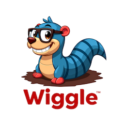

# Wiggle the Multi-Node LLM Processing Framework



Wiggle provides a flexible and modular library for chaining multiple Language Learning Models (LLMs), integrating context from various sources like vector databases, and efficiently processing large or complex data by partitioning tasks across nodes and integrating results. The framework is designed to support both large models (e.g., GPT-4) and smaller models (e.g., LLaMA 3.1), ensuring scalability, modularity, and efficiency.

Wiggle tries to be a good Go citizen. It is a library more than a framework despite being called a framework. It has batteries but does not require they are used. The core of Wiggle is a set of defined interfaces. Entire applications can be written by simple using the interfaces to define your Node structure. However, most all of the Node and supporting types have implementations available in the nlib directory. Depending on the task being worked on a mix of predefined structures and domain specific ones generally works best.

## Features

- Modular Design: Nodes encapsulate specific processes, and can be easily chained together to form more complex workflows.
- Node Types: Wiggle provides a wide range of node types including , partitioning, integration, looping, branching, I/O handling, and more.
- Set Node: Advanced encapsulation feature that allows for sub-flows and modularization within workflows.
- LLM Support: Chain together large language models (LLMs) from any vendor local or in the cloud

## Tools

[Wiggle Tools](https://github.com/dshills/wiggle-tools) contains dependency free interfaces for external tools to be used in Nodes

- vector package
    - Pinecone
    - Qdrant
- container package
    - Docker

## Architecture

The architecture goals from the beginning was to define all relevant pieces using interfaces. This allows for simple workflows without much work but can be scaled by adding more complex implementations. Things like resource management, concurrency synchronization, branch logic, sub workflows, etc.

The system consists of several key components:

1. Nodes: Individual units of work that process data in the form of Signals. Nodes can be action nodes, query nodes, partitioner nodes, or integrator nodes.
2. Signals: Data structures passed between nodes, containing data, context, metadata, and history.
3. Guidance: Interface for generating processing instructions based on the signal’s data and context.
4. Partitioning: Split large data into smaller chunks that are processed independently by multiple nodes.
5. Integration: Combine the results of partitioned tasks into a coherent final result.
6. Native support for JSON schema to define output formats

## Installation

To install, simply add the repository to your Go project:

```sh
go get github.com/dshills/wiggle
```

## Basic Usage

Here’s a simple example of creating a workflow with nodes.

```go
package main

import (
	"log"
	"os"

	"github.com/dshills/wiggle/llm/openai"
	"github.com/dshills/wiggle/nlib"
	"github.com/dshills/wiggle/node"
)

const envURL = "OPENAI_API_URL"
const envKey = "OPENAI_API_KEY"
const model = "gpt-4o"

func main() {
	// Setup LLM
	lm := openai.New(os.Getenv(envURL), model, os.Getenv(envKey), nil)

	// Create a Logger
	logger := nlib.NewSimpleLogger(log.Default())

	// Create State Manager
	stateMgr := nlib.NewSimpleStateManager(logger)

	// Define output writer
	writer := os.Stdout

	// Create Nodes
	firstNode := nlib.NewAINode(lm, stateMgr, node.Options{ID: "AI-Node"})
	outNode := nlib.NewOutputStringNode(writer, stateMgr, node.Options{ID: "Output Node"})

	// Connect
	firstNode.Connect(outNode)

	sig := node.Signal{
		NodeID: firstNode.ID(),
		Task:   &nlib.Carrier{TextData: "Why is the sky blue?"},
	}

	// Send it
	firstNode.InputCh() <- sig

	// Wait for the output node to print the result
	stateMgr.WaitFor(outNode)
}
```

## Core Concepts

### Signal

A Signal represents the data structure passed between nodes, containing the main data being processed, its context, and any metadata or history required. It ensures smooth and coherent propagation of data and context across the entire node chain.

```go
type Signal struct {
	NodeID   string
	Data     DataCarrier
	Response DataCarrier
	Context  ContextManager
	Meta     []Meta
	History  HistoryManager
	Err      error
	Status   string
}
```

### Node

A Node is the core processing unit in Wiggle. It processes incoming signals, executes actions (such as querying a model or transforming data), and forwards the processed signal to connected nodes. The interface is modular, allowing different node types to be chained together for flexible workflows. A Node can literally do anything you want. It only has to satisfy the interface.

```go
type Node interface {
    Connect(...Node)                // Connect other Nodes to receive output
    ID() string                     // Node identifier
    InputCh() chan Signal           // Start processing by sending to the input
    SetID(string)                   // Set the Node ID
    SetOptions(Options)             // Many advanced features pre and post processing functions, Error guidance, LLM Guidance, etc
    SetStateManager(StateManager)   // Set the state manager
}
```

### StateManager

StateManager is responsible for tracking and updating the state of a signal as it moves through the node chain. It provides methods to update and retrieve the current state, ensuring that each node can access the relevant status information. This interface helps maintain workflow consistency and manage state transitions across complex processes.

```go
type StateManager interface {
    GetState(Signal) State
    UpdateState(Signal)

    ContextManager() ContextManager     // Pass context between nodes
    Coordinator() Coordinator           // Advanced: Coordinate synchronization
    HistoryManager() HistoryManager     // Manage history of processing
    Logger() Logger                     // Log processing
    ResourceManager() ResourceManager   // Advanced: Manage resources Rate limit, etc

    SetContextManager(ContextManager)
    SetCoordinator(Coordinator)
    SetHistoryManager(HistoryManager)
    SetLogger(Logger)
    SetResourceManager(ResourceManager)

    Register() chan struct{}            // Register for done chan
    Complete()                          // Finish the processing
    WaitFor(Node)                       // Block for completion

    Log(string)
    GetContext(key string) (DataCarrier, error)
    SetContext(key string, data DataCarrier)
    RemoveContext(key string)

    AddHistory(Signal)
    GetHistory() []Signal
    FilterHistory(nodeid string) []Signal
}
```

### Partitioner Node

A PartitionerNode splits large or complex tasks into smaller chunks using a partitioning function (PartitionerFn), enabling parallel processing by downstream nodes. This design allows for efficient handling of large-scale data processing.

```go
type PartitionerNode interface {
    Node
    SetPartitionFunc(PartitionerFn) // Function that splits the task into n components
    SetNodeFactory(Factory)         // A Factory will generate Nodes to use for each component
    SetIntegrator(IntegratorNode)   // Function that takes the combined output of processing and integrates them into a single result
}
```

## Node Types

- AI Node: Any Node can have an LLM attached
- InputNode: Handles receiving input data from external sources.
- PartitionNode: Splits tasks into smaller pieces and processes each piece
- OutputNode: Manages output, sending data to its final destination.
- BranchNode: Provides conditional branching.
- LoopNode: Enables looping within workflows.
- SetNode: Encapsulates sub-flows for more complex, modular designs.

## JSON Schema support

Integrate JSON Schemas to fine tune data output formats

## Development

Wiggle is under heavy development and we welcome ideas and contributions.  If you’d like to improve this framework or report issues, feel free to create a pull request or open an issue.

## License

This project is licensed under the MIT License. See the LICENSE file for details.
